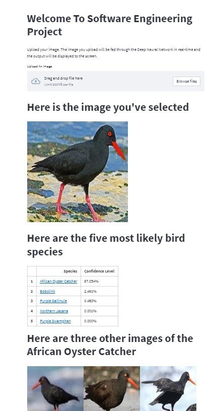

[Project Homepage](https://share.streamlit.io/joshmantova/eagle-vision/prod/src/Project_Eagle_Vision.py)

Technologies used: 
* Python
* Keras
* PIL
* Streamlit
* AWS EC2

# Summary
This project involved using Deep Convolutional Neural network to create a machine learining application that could classify 400 bird species based on images. The model architecture is a CNN, (https://en.wikipedia.org/wiki/Convolutional_neural_network) that was initially trained on the [BIRDS450 Dataset](https://www.kaggle.com/datasets/gpiosenka/100-bird-species). After training, the model correctly identified 77% of bird images held out from training. The trained model was then deployed in an interactive website to allow users to identify their own bird pictures.

# Dataset
Data set of 450 bird species. 70,626 training images, 2250 test images(5 images per species) and 2250 validation images(5 images per species. This is a very high quality dataset where there is only one bird in each image and the bird typically takes up at least 50% of the pixels in the image. All images are 224 X 224 X 3 color images in jpg format. Data set includes a train set, test set and validation set. Each set contains 450 sub directories, one for each bird species. 

Images were gather from internet searches by species name. Once the image files for a species was downloaded they were checked for duplicate images using a python duplicate image detector program I developed. All duplicate images detected were deleted in order to prevent their being images common between the training, test and validation sets. After that the images were cropped so that the bird in most cases occupies at least 50% of the pixel in the image. Then the images were resized to 224 X 224 X3 in jpg format. The cropping ensures that when processed by a CNN their is adequate information in the images to create a highly accurate classifier.

All files were also numbered sequential starting from one for each species. So test images are named 1.jpg to 5.jpg. Similarly for validation images. Training images are also numbered sequentially with "zeros" padding. For example 001.jpg, 002.jpg ….010.jpg, 011.jpg …..099.jpg, 100jpg, 102.jpg etc. The zero's padding preserves the file order when used with python file functions and Keras flow from directory.

# Model Architecture
A Convolutional Neural Network model was used as the model for this project. It consists of a convolutional layer, a maxpooling one, another convolutional and a fully connected one (Dense). As Dense layers can only receive 1D inputs, we use Flatten() to unroll the 3D activation volume of the 2nd convolutional layer to a 1D vector.

- For activation function, 'softmax' and 'relu' were used.

- For loss function, CategoricalCrossentropy() was used.

- For optimizers Adam() optimizer was used.

- The filter number in each layer has been incrementally increased, 64-> 128 -> 256.

# Model Scores
* Training accuracy, weighted recall, weighted precision, and weighted F1 scores were all .99
    * Validation scores were all .98
    * Holdout test scores were all .98

# Streamlit App

An interface where users can upload an image and get a prediction after the image is fed to the trained model is created using Streamlit. The website shows top five predictions together with the confidence levels of each prediction. Three other pictures of the species that has the highest confidence level and is the final prediction are also shown on the website.

# Future direcitons
* The accuracy score of the model could be increased
* A detection algorithm could be implemented to detect if the uploaded picture belongs to a bird or not.
* A message can be shown to the user stating that the prediction may not be true and what could be done to avoid it (make sure the resolution of the picture is high, make sure that the bird takes up at least 50% of the image etc.) if the prediction confidence level is very low for the top prediction.
